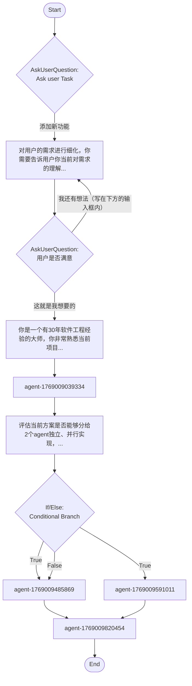

## Workflow Execution Guide

Follow the Mermaid flowchart above to execute the workflow. Each node type has specific execution methods as described below.

### Execution Methods by Node Type

- **Rectangle nodes**: Execute Sub-Agents using the Task tool
- **Diamond nodes (AskUserQuestion:...)**: Use the AskUserQuestion tool to prompt the user and branch based on their response
- **Diamond nodes (Branch/Switch:...)**: Automatically branch based on the results of previous processing (see details section)
- **Rectangle nodes (Prompt nodes)**: Execute the prompts described in the details section below

### Prompt Node Details

#### prompt_1762065918375(对用户的需求进行细化，你需要告诉用户你当前对需求的理解...)

```
对用户的需求进行细化，你需要告诉用户你当前对需求的理解，对模糊的地方追问用户细节。
```

#### prompt_1769008925924(你是一个有30年软件工程经验的大师，你非常熟悉当前项目...)

```
你是一个有30年软件工程经验的大师，你非常熟悉当前项目你需要基于用户完整的需求，结合已有代码逻辑，分析可行性以及实现方案
```

#### prompt_1769009063733(评估当前方案是否能够分给2个agent独立、并行实现，...)

```
评估当前方案是否能够分给2个agent独立、并行实现，然后git merge。你需要判断，然后输出true或者false。如果是true，还需要列举出拆分后的两个子任务。
```

### AskUserQuestion Node Details

Ask the user and proceed based on their choice.

#### question_1762065541316(Ask user Task)

**Selection mode:** Single Select (branches based on the selected option)

**Options:**
- **添加新功能**: 用户提出新的需求，结合工程已有逻辑评估如何添加功能
- **重构已有功能**: 分析某个功能模块的合理性，然后进行合理重构
- **删除某个功能**: 梳理给定功能的逻辑，找出所有引用关系，然后安全删除所有相关逻辑

#### question_1769008631742(用户是否满意)

**Selection mode:** Single Select (branches based on the selected option)

**Options:**
- **这就是我想要的**: First option
- **我还有想法（写在下方的输入框内）**: Second option

### If/Else Node Details

#### ifelse_1769009387441(Binary Branch (True/False))

**Evaluation Target**: 输出true+具体子任务为true，输出false为false

**Branch conditions:**
- **True**: When condition is true
- **False**: When condition is false

**Execution method**: Evaluate the results of the previous processing and automatically select the appropriate branch based on the conditions above.
